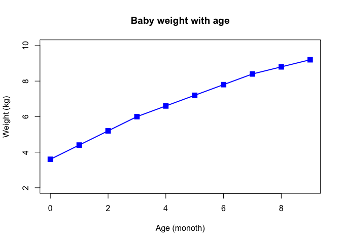
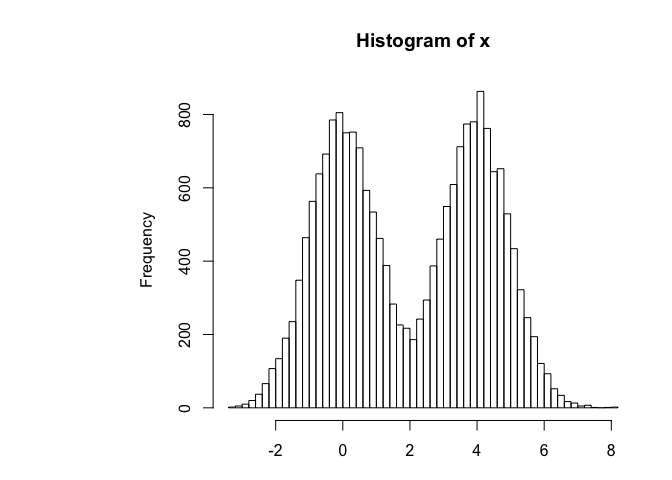
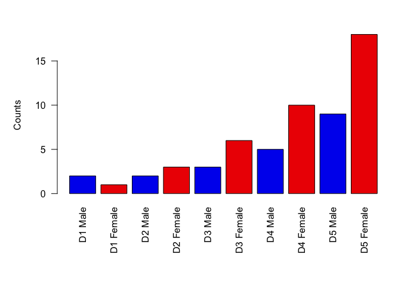
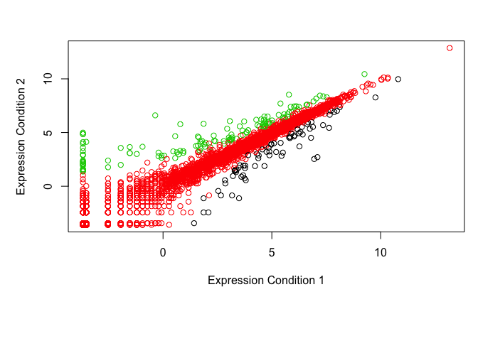

Crop Analysis Q3 2013
================
tonycheng
2019-11-01

``` r
# Class 5 Data Visualization
weight = read.table("bimm143_05_rstats/weight_chart.txt", 
                    header = TRUE)
plot(weight$Age, weight$Weight, type="o", pch = 15, cex = 1.5, lwd=2, ylim=c(2,10), 
     xlab = "Age (monoth)", ylab="Weight (kg)", main="Baby weight with age", col="blue")
```

<!-- -->

``` r
mouse = read.delim("bimm143_05_rstats/feature_counts.txt")
# Another way
#mouse= read.table("bimm143_05_rstats/feature_counts.txt", header=TRUE, sep="\t")

par(mar=c(3.1, 11.1, 4.1, 2))  # from bottom, left, top, right
barplot(mouse$Count, horiz=TRUE, ylab= "", names.arg = mouse$Feature, las=1,
        main= "Number of features in the mouse GRCm38 genome", xlim = c(0, 80000))
```

<!-- -->

``` r
x <- c(rnorm(10000),rnorm(10000)+4)
hist(x, breaks=80)
```

<!-- -->

``` r
mf_count = read.delim("bimm143_05_rstats/male_female_counts.txt")
par(mar=c(8,5,3,1))
barplot(mf_count$Count, names.arg = mf_count$Sample, col=c("blue2", "red2"), las=2,
        ylab="Counts")
```

<!-- -->

``` r
genes = read.delim("bimm143_05_rstats/up_down_expression.txt")
table(genes$State)
```

    ## 
    ##       down unchanging         up 
    ##         72       4997        127

``` r
plot(genes$Condition1, genes$Condition2, col=genes$State, xlab ="Expression Condition 1", 
     ylab = "Expression Condition 2")
```

<!-- -->

``` r
palette(c("blue", "gray", "red"))
levels(genes$State)
```

    ## [1] "down"       "unchanging" "up"
