class08\_RMD
================
Pin-Chung (Tony) Cheng
2019-10-25

# K mean example

``` r
tmp <- c(rnorm(30,-3), rnorm(30,3))
x <- cbind(x=tmp, y=rev(tmp))
plot(x)
```

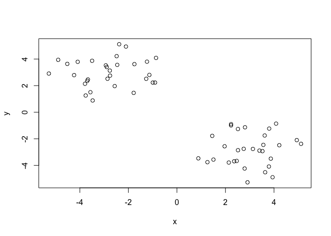<!-- -->

Use kmeans function

``` r
k = kmeans(x, centers=2, nstart = 20)
```

print it out

``` r
print(k)
```

    ## K-means clustering with 2 clusters of sizes 30, 30
    ## 
    ## Cluster means:
    ##           x         y
    ## 1  3.259058 -2.923785
    ## 2 -2.923785  3.259058
    ## 
    ## Clustering vector:
    ##  [1] 2 2 2 2 2 2 2 2 2 2 2 2 2 2 2 2 2 2 2 2 2 2 2 2 2 2 2 2 2 2 1 1 1 1 1 1 1 1
    ## [39] 1 1 1 1 1 1 1 1 1 1 1 1 1 1 1 1 1 1 1 1 1 1
    ## 
    ## Within cluster sum of squares by cluster:
    ## [1] 58.82347 58.82347
    ##  (between_SS / total_SS =  90.7 %)
    ## 
    ## Available components:
    ## 
    ## [1] "cluster"      "centers"      "totss"        "withinss"     "tot.withinss"
    ## [6] "betweenss"    "size"         "iter"         "ifault"

check ur cluster

``` r
table(k$cluster)
```

    ## 
    ##  1  2 
    ## 30 30

plot with k cluster, add cluster centers as blue points

``` r
plot(x, col = k$cluster)
# points function add features to existing plot
points(k$centers, col="blue", pch=15)
```

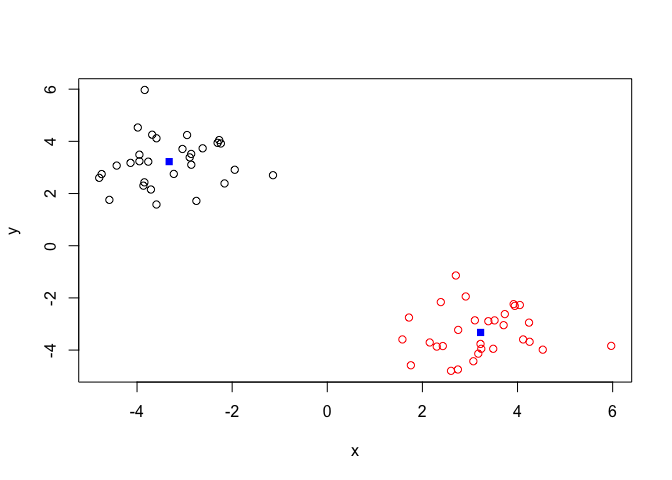<!-- -->

Hierarchical clustering in R

``` r
hc = hclust(dist(x))
hc
```

    ## 
    ## Call:
    ## hclust(d = dist(x))
    ## 
    ## Cluster method   : complete 
    ## Distance         : euclidean 
    ## Number of objects: 60

plot hc

``` r
plot(hc)

# draw a line to cut tree! and here u get two big branch, 2 clusters!
# height is like the distance difference
abline(h=6, col="red")
abline(h=3, col= "blue")
```

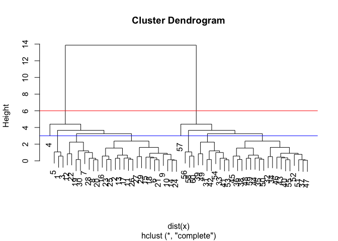<!-- -->

``` r
# return a vector of groups
grp1 = cutree(hc, h=6)
grp2 = cutree(hc, h=4)
grp3 = cutree(hc, h=3)

# define how many k group
grp4 = cutree(hc, k=2)
```

check ut group with table()

``` r
table(grp4)
```

    ## grp4
    ##  1  2 
    ## 30 30

plot

``` r
plot(x, col=grp4)
```

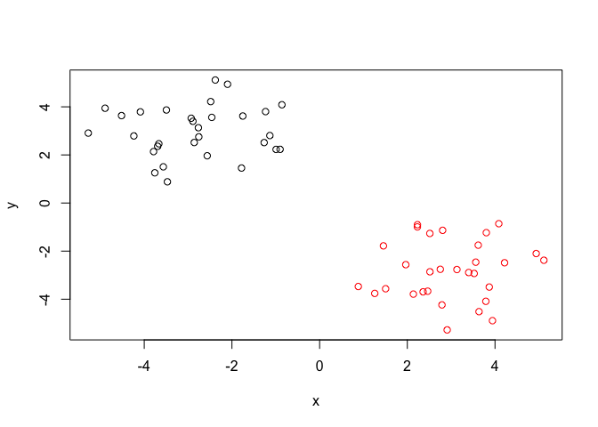<!-- -->

Slide sample

``` r
# Step 1. Generate some example data for clustering
x <- rbind(
 matrix(rnorm(100, mean=0, sd = 0.3), ncol = 2), # c1
 matrix(rnorm(100, mean = 1, sd = 0.3), ncol = 2), # c2
 matrix(c(rnorm(50, mean = 1, sd = 0.3), # c3
 rnorm(50, mean = 0, sd = 0.3)), ncol = 2))
colnames(x) <- c("x", "y")
# Step 2. Plot the data without clustering
plot(x)
```

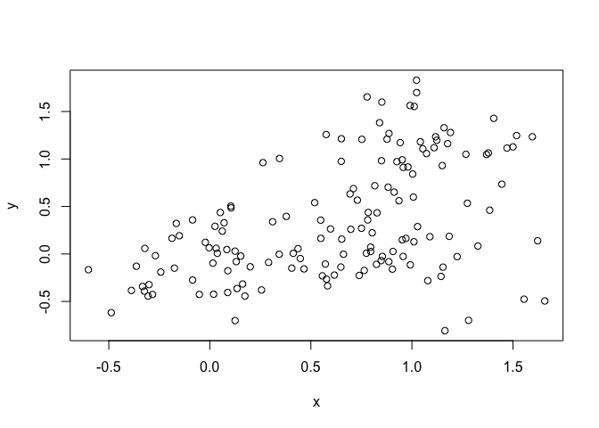<!-- -->

``` r
# Step 3. Generate colors for known clusters
# (just so we can compare to hclust results)
col <- as.factor( rep(c("c1","c2","c3"), each=50) )
plot(x, col=col)
```

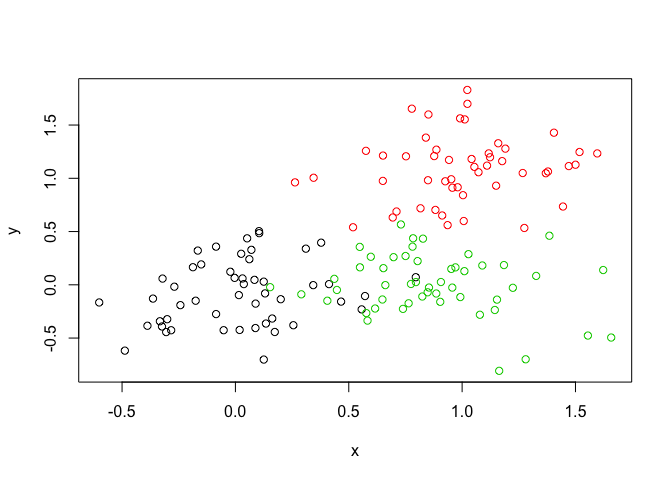<!-- -->

Make it into hc

``` r
hc = hclust(dist(x))
plot(hc)
```

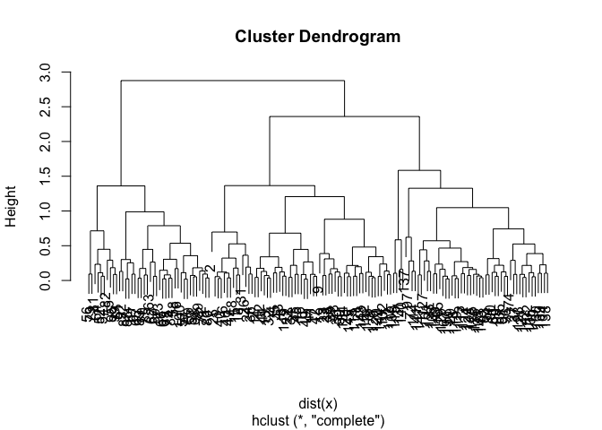<!-- -->

``` r
grp5 = cutree(hc, k=3)
table(grp5, col)
```

    ##     col
    ## grp5 c1 c2 c3
    ##    1 34  0  0
    ##    2 16  6 49
    ##    3  0 44  1

``` r
plot(x, col=grp5)
```

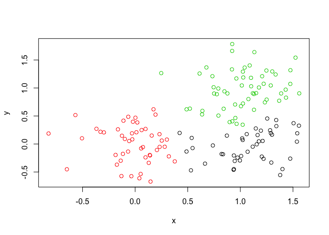<!-- -->

``` r
mydata <- read.csv("https://tinyurl.com/expression-CSV", row.names = 1) 
head(mydata)
```

    ##        wt1 wt2  wt3  wt4 wt5 ko1 ko2 ko3 ko4 ko5
    ## gene1  439 458  408  429 420  90  88  86  90  93
    ## gene2  219 200  204  210 187 427 423 434 433 426
    ## gene3 1006 989 1030 1017 973 252 237 238 226 210
    ## gene4  783 792  829  856 760 849 856 835 885 894
    ## gene5  181 249  204  244 225 277 305 272 270 279
    ## gene6  460 502  491  491 493 612 594 577 618 638

``` r
str(mydata)
```

    ## 'data.frame':    100 obs. of  10 variables:
    ##  $ wt1: int  439 219 1006 783 181 460 27 175 658 121 ...
    ##  $ wt2: int  458 200 989 792 249 502 30 182 669 116 ...
    ##  $ wt3: int  408 204 1030 829 204 491 37 184 653 134 ...
    ##  $ wt4: int  429 210 1017 856 244 491 29 166 633 117 ...
    ##  $ wt5: int  420 187 973 760 225 493 34 180 657 133 ...
    ##  $ ko1: int  90 427 252 849 277 612 304 255 628 931 ...
    ##  $ ko2: int  88 423 237 856 305 594 304 291 627 941 ...
    ##  $ ko3: int  86 434 238 835 272 577 285 305 603 990 ...
    ##  $ ko4: int  90 433 226 885 270 618 311 271 635 982 ...
    ##  $ ko5: int  93 426 210 894 279 638 285 269 620 934 ...

prcomp function

``` r
pca = prcomp(t(mydata), scale = TRUE)
# check whats in pca
attributes(pca)
```

    ## $names
    ## [1] "sdev"     "rotation" "center"   "scale"    "x"       
    ## 
    ## $class
    ## [1] "prcomp"

``` r
# get pca components in x , and column means pca1, pca2 ....
plot(pca$x[,1], pca$x[,2])
```

<!-- -->

``` r
summary(pca)
```

    ## Importance of components:
    ##                           PC1    PC2     PC3     PC4     PC5     PC6     PC7
    ## Standard deviation     9.6237 1.5198 1.05787 1.05203 0.88062 0.82545 0.80111
    ## Proportion of Variance 0.9262 0.0231 0.01119 0.01107 0.00775 0.00681 0.00642
    ## Cumulative Proportion  0.9262 0.9493 0.96045 0.97152 0.97928 0.98609 0.99251
    ##                            PC8     PC9      PC10
    ## Standard deviation     0.62065 0.60342 3.348e-15
    ## Proportion of Variance 0.00385 0.00364 0.000e+00
    ## Cumulative Proportion  0.99636 1.00000 1.000e+00

``` r
## Variance captured per PC
pca.var <- pca$sdev^2 
# try plot pca
plot(pca)
```

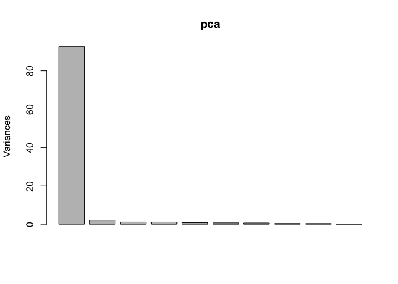<!-- -->

``` r
plot(pca$x[,1:2], col=c("red","red","red","red","red","blue","blue","blue","blue","blue"))
```

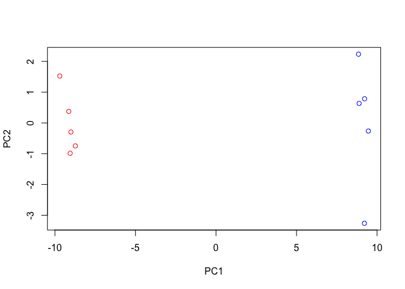<!-- -->

``` r
col = c(rep("green",5), rep("blue",5))
plot(pca$x[,1:2], col=col)       
```

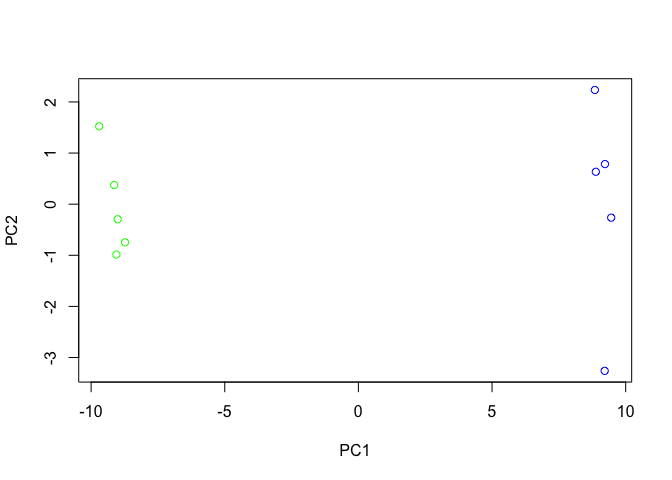<!-- -->

Hands on exercise

``` r
x <- read.csv("UK_foods.csv", row.names = 1)
dim(x)
```

    ## [1] 17  4

\`\`\`

``` r
pairs(x, col=rainbow(10), pch=16)
```

<!-- -->

pca

``` r
pca = prcomp(t(x))
summary(pca)
```

    ## Importance of components:
    ##                             PC1      PC2      PC3       PC4
    ## Standard deviation     324.1502 212.7478 73.87622 4.189e-14
    ## Proportion of Variance   0.6744   0.2905  0.03503 0.000e+00
    ## Cumulative Proportion    0.6744   0.9650  1.00000 1.000e+00

``` r
plot(pca$x[,1], pca$x[,2], xlab="PC1", ylab="PC2", xlim=c(-270,500))
text(pca$x[,1], pca$x[,2], colnames(x), col=c("red", "blue", "green","orange"))
```

<!-- -->

``` r
par(mar=c(10, 3, 0.35, 0))
barplot( pca$rotation[,1], las=2 )
```

<!-- -->

``` r
## Lets focus on PC2 as it accounts for > 90% of variance 
par(mar=c(10, 3, 0.35, 0))
barplot( pca$rotation[,2], las=2 )
```

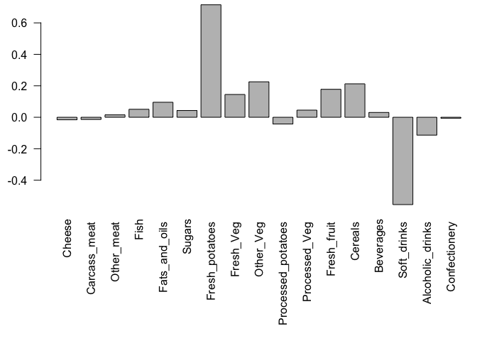<!-- -->

biplot

``` r
biplot(pca)
```

<!-- -->
